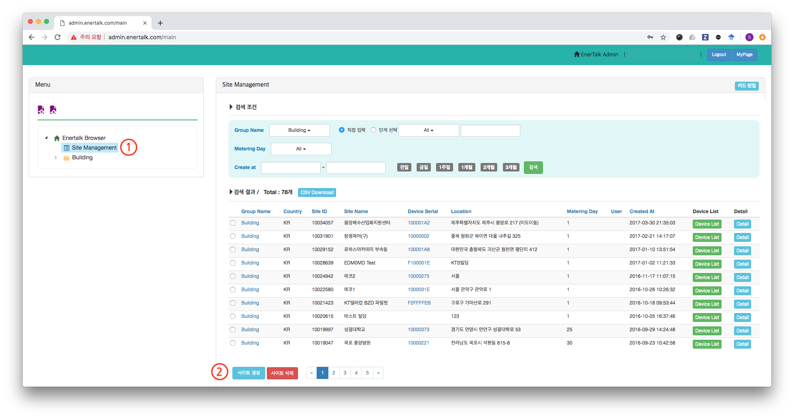
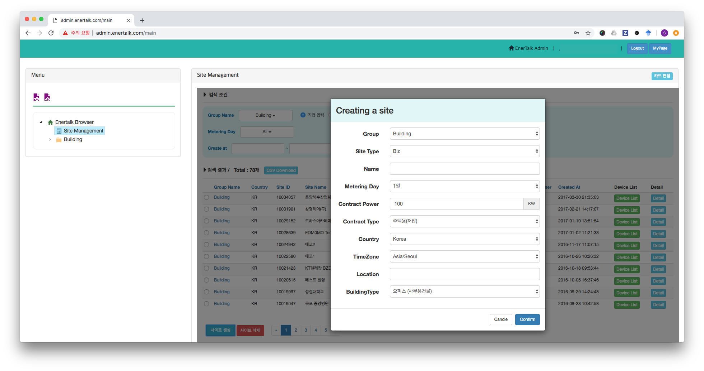
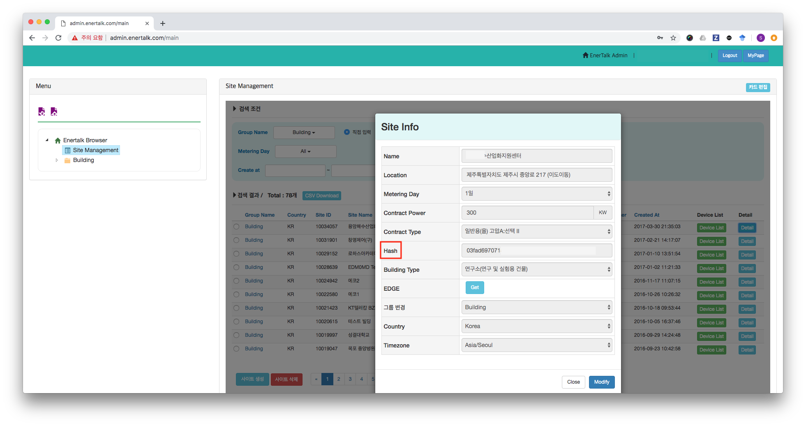

## 사이트 아이디/Hash 생성

1. 에너톡 관리자 페이지를 접속합니다.
	- 관리자 페이지 URL : http://admin.enertalk.com/main
2. 화면 왼쪽 메뉴에서 `Site Management` 를 클릭합니다.
	- 메뉴에서 `Site Management`가 보이지 않는 경우 메뉴 트리에서 우클릭을 한 후 페이지를 추가할 수 있습니다.

3. 화면 오른쪽의 `Site Management`카드에서 왼쪽 아래에 있는 `사이트 생성` 버튼을 클릭합니다.
4. `Creating a site` 팝업이 뜨면 생성할 사이트의 정보를 입력하고, 모든 정보를 입력한 다름 Confirm을 클릭합니다.

	- Group : 그룹
	- Site Type 
	- Name : 사이트 이름 입력
	- Metering Day : 한전 검침일 선택
	- Contract Power : 한전 계약 전력 입력
	- Contract Type : 한전 요금제 선택
	- Country : 국가 선택
	- TimeZone : 시간대 선택
	- Location : 주소 입력
	- BuildingType : 건물 용도 선택
5. 입력한 사이트 정보가 화면에 표시되면 Site ID를 확인할 수 있습니다. Hash값은 Detail 버튼을 클릭하면 확인할 수 있습니다.

